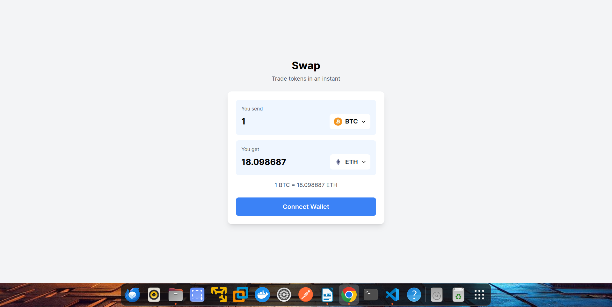
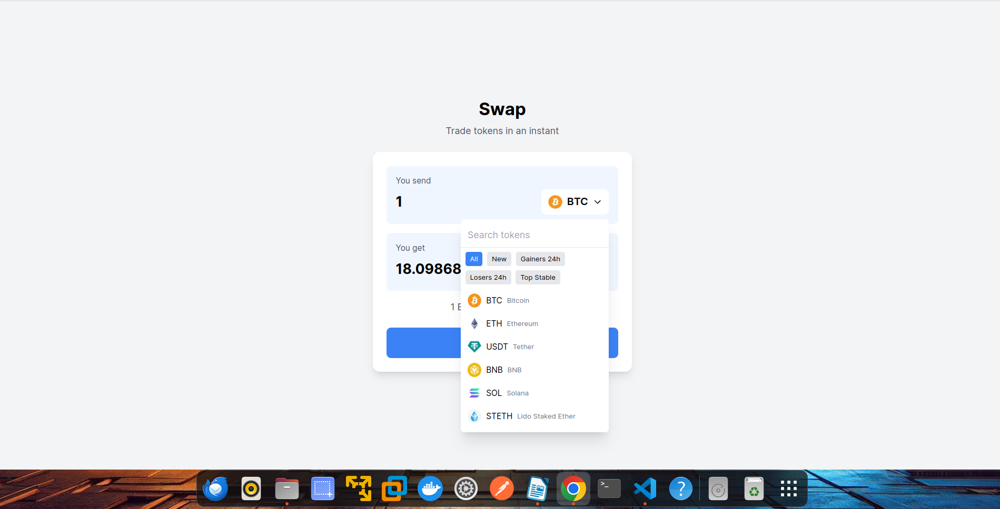

<p align="center">
  
</p>
<p align="center">
  
</p>

## Getting Started

First, run the development server:

```bash
git clone  https://github.com/LGROW101/Full-Blockchain.git
cd Full-Blockchain
cd f-blockchain

npm run dev

```

Open [http://localhost:3000](http://localhost:3000) with your browser to see the result.

You can start editing the page by modifying `app/page.tsx`. The page auto-updates as you edit the file.

This project uses [`next/font`](https://nextjs.org/docs/basic-features/font-optimization) to automatically optimize and load Inter, a custom Google Font.
